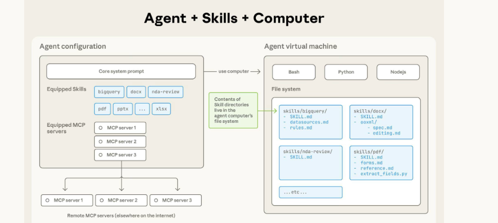
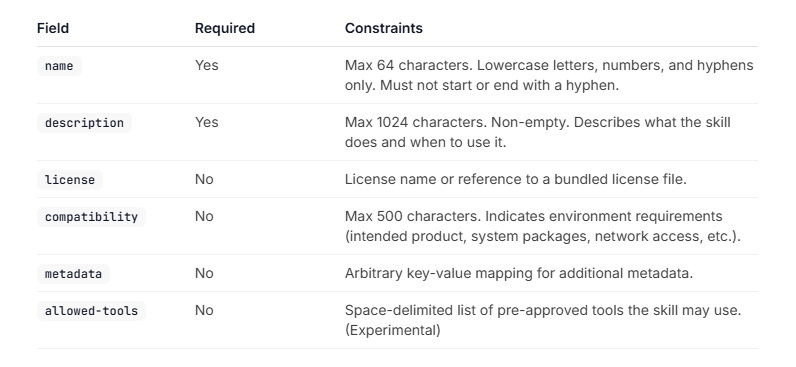

# Agent Skills
## Table Of Contents
- [What are Skills?](#what-are-skills)
    - [Overview](#overview)
    - [How SKills Work](#how-skills-work)
    - [The `Skill.md` File](#the-skillmd-file)
- [Agent Skils Diagram](#agent-skills-diagram)
- [Skills Speficication](#skills-specification)
## What are skills?
### Overview
#### What is an “Agent Skill”
- Agent Skills are a lightweight, open format for extending AI agent capabilities with specialized knowledge and workflows.
- A skill is a packaged capability you give to an AI agent so it knows:
    - What it is good at
    - How to do a specific task
    - What rules, steps, or references to follow
    - What code to run

#### Why Skill Exist
- Without skills, an agent:
    - Only has general reasoning
    - Needs long prompts every time
    - Forgets structured workflows
    - Has no persistent task identity
- With skills:
    - Knowledge is **modular**
    - Behavior is **repeatable**
    - Instructions are **versioned**
    - Tools + instructions stay **aligned**
### How skills work
#### Skills use progressive disclosure to manage context efficiently
- Progressive disclosure means:
    - Don’t load everything upfront
    - Only reveal more details when they’re actually needed

#### The 3 phases of how skills work
1. Discovery (startup phase)
- At startup, agents load only the name and description of each available skill
- **What actually happens here**
    - When your agent boots:
        - It does NOT read every `SKILL.md`
        - It only loads:
            - `name`
            - `description`
        - That’s it.
    - Example:
    ```json
    [
        {
            "name": "Weather Analyst",
            "description": "Get US weather forecasts and alerts"
        },
        {
            "name": "Web Scraper",
            "description": "Extract readable content from webpages"
        }
    ]

    ```
- **Why this is critical**
    - Keeps startup fast
    - Keeps base prompt small
    - Prevents instruction overload
    - Lets the agent decide relevance instead of guessing

2. **Activation (matching phase)**
- When a task matches a skill’s description, the agent reads the full `SKILL.md`
- What triggers activation?
    - “What’s the weather in San Diego?”
    - “Scrape this webpage”
    - “Search for recent AI news”
- The agent:
    - 1. Compares the query
    - 2. Matches it against skill descriptions
    - 3. Chooses the most relevant skill
    - 4. Loads the full `SKILL.md` into context
3. **Execution (doing the work)**
- The agent follows the instructions, optionally loading files or executing code
- The agent will:
    - Follow the workflow defined in `SKILL.md`
    - Decide which tools to call
    - Use references if mentioned
    - Respect constraints (format, safety, validation)
- Important clarification
    - Skills **do not execute tools themselves**.

#### So the flow is:
```sql
User question
   ↓
Skill activated
   ↓
Skill instructions guide reasoning
   ↓
Agent calls MCP tools
   ↓
Tools return results
   ↓
Agent formats output per skill rules

```
### The `SKILL.md` File
#### 1. SKILL.md = YAML frontmatter + Markdown body
- A SKILL.md file has two parts:
    - **A) YAML “frontmatter” (the metadata header)**
        - It’s the block at the very top between --- lines:
        ```yaml
        ---
        name: pdf-processing
        description: Extract text and tables from PDF files, fill forms, merge documents.
        ---

        ```
        - What this is for:
            - The agent can load just this during **Discovery** (startup).
            - It enables **fast routing**: “Do I have a skill relevant to PDFs?”
    - **B) Markdown body (the actual instructions)**
        - Everything after the frontmatter is just normal Markdown:
        ```md
        # PDF Processing

        ## When to use this skill
        Use this skill when the user needs to work with PDF files...

        ## How to extract text
        1. Use pdfplumber...

        ## How to fill forms
        ...

        ```
        - What this is for:
            - Loaded during Activation
            - Gives the agent step-by-step workflow + rules + output format


## Agent Skills Diagram

### 1. Core system prompt
- This is the agent’s baseline personality and rules.
- Examples:
    - “You are a helpful assistant”
    - Safety rules
    - Output tone
    - High-level behavior constraints
### 2. Equipped Skills (blue tags)
- Examples shown:
    - bigquery
    - docx
    - nda-review
    - pdf
    - pptx
    - xlsx
- These are **skills you’ve installed** for this agent.
### 3. Equipped MCP servers
- Examples:
    - MCP server 1
    - MCP server 2
    - MCP server 3
- These are **external capability providers**.
### 4. Remote MCP servers
- Shown at the bottom:
    - “Remote MCP servers (elsewhere on the internet)”
- This highlights:
    - MCP servers do not live inside the agent
    - They can be local or remote
    - They expose tools via a standard protocol
### 5. Bash / Python / Node.js
- These represent:
    - Execution runtimes available to the agent
    - Languages the agent can use if needed
- Important:
    - The agent does not invent these
    - They’re provided by the environment
- Examples:
    - Bash: file ops, CLI tools
    - Python: scripts, parsing, automation
    - Node.js: JS tooling, web tasks

### 6. File system (critical part)
- This is where skills **physically live**.
- The green note says:
    - “Contents of skill directories live in the agent computer’s file system”
- That means:
    - Each skill is a real folder
    - Not just text in a prompt
    - The agent can read them when activated
### Skills as directories (blue boxes)

## Skills Specification

### 1. The `name` field (identity + filesystem contract)
- **The required name field**
- The name is not just a label — it’s an identifier that must stay consistent across the system.
- Think of it as:
    - a package name
    - a command name
    - a directory name
    - a routing key
#### 1.1 Length rule (1–64 characters)
- Must be 1–64 characters

- Why:
    - Short enough for prompts and logs
    - Long enough to be descriptive
    - 
#### 1.2 Allowed characters (lowercase alphanumeric + hyphen)
- May only contain unicode lowercase alphanumeric characters and hyphens (`a-z`, `0-9`, `-`)
- Why this exists:
    - Safe across filesystems
    - Safe in URLs
    - Safe in JSON/YAML
    - Easy to tokenize for LLMs
- No spaces, no underscores, no uppercase.

#### 1.3 Must not start or end with `-`
- Must not start or end with hyphen
- Why:
    - Prevents ambiguous parsing
    - Avoids ugly edge cases (`-skill`, `skill-`)
    - Matches package naming conventions (npm, pip, docker)

#### 1.4 No consecutive hyphens (`--`)
- Must not contain consecutive hyphens
- Why:
    - Prevents accidental separators
    - Avoids parsing ambiguity
    - Encourages readable names
- Instead of:
    ```css
    pdf--processing

    ```
- Use:
    ```css
    pdf-processing

    ```

#### 1.5 Must match the parent directory name (very important)
- Must match the parent directory name
- This is the filesystem ↔ metadata binding.
- Example:
    - 

### 2. The description field (routing intelligence)
- **The required `description` field**
- This field is how the agent decides to activate the skill.
- If the description is bad, the skill is effectively invisible.
#### 2.1 Length rule (1–1024 characters)
- Must be 1–1024 characters
- Why:
    - Enough space for meaningful intent description
    - Prevents prompt bloat
    - Forces concise writing
#### 2.2 Must describe BOTH “what” and “when”
- Should describe both what the skill does and when to use it
- This is the most common mistake.
- Bad description only says what:
    - “Extracts text from PDFs.”
- Good description says what + when:
    - “Extracts text and tables from PDF files. Use when the user needs to read, analyze, or process PDF documents.”
#### 2.3 Should include keywords (critical for matching)
- Should include specific keywords that help agents identify relevant tasks
- The agent matches user intent ↔ description text.
- So include:
    - verbs users say
    - file types
    - task types
    - synonyms
- For PDFs:
    - extract
    - fill forms
    - tables
    - merge
    - split
    - OCR
    
### 3. `license` field (legal + reuse clarity)
- **The optional `license` field specifies the license applied to the skill**
- **What this field is for**
    - This field answers one simple question:
        - “Under what legal terms can this skill be used, copied, or modified?”
    - Remember: a skill may include:
        - instructions
        - code (.py, .sh)
        - templates
        - reference docs
    - Those are **copyrightable assets**.
- Why the spec recommends keeping it short
    - “Either the name of a license or the name of a bundled license file”
    - This is deliberate:
        - The frontmatter stays compact
        - Full legal text lives elsewhere
        - Machines don’t need legal prose
    - Example from the screenshot: