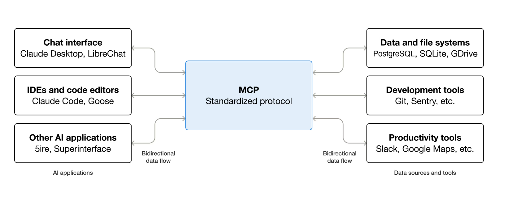
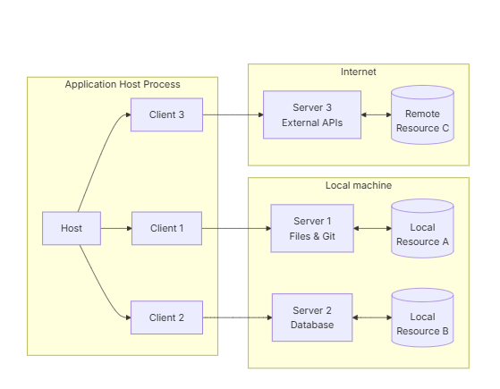
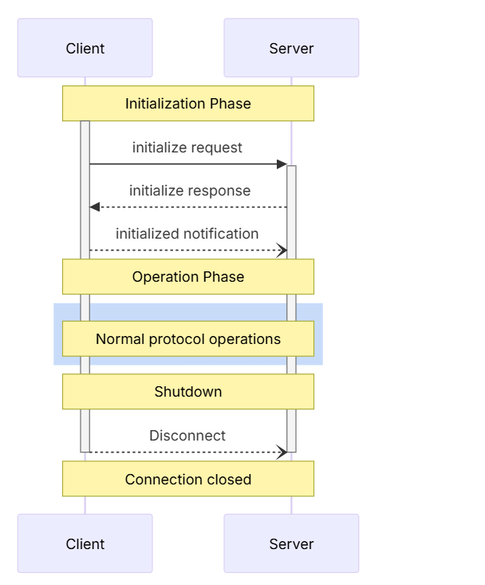

# MCP Concepts
## Table of Contents
- [What is MCP](#what-is-mcp)
    - [MCP is an Open Source Standard for Connecting AI Applications to External Systems](#1-mcp-is-an-open-source-standard-for-connecting-ai-applications-to-external-systems)
    - [Using MCP, AI Applications Can Connect to Data Sources, Tools, and Workflows](#2-using-mcp-ai-applications-can-connect-to-data-sources-tools-and-workflows)
    - [Protocol Messages](#protocol-messages)
        - [Listing Tools(tools/list)](#1-listing-tools-toolslist)
        - [Calling Tools(tools/cal)](#2-calling-tools-toolscall)
## What is MCP
### 1. “MCP is an open-source standard for connecting AI applications to external systems”
- Open-source standard
    - Not a product
    - Not tied to one company
    - Anyone can implement it (Claude, ChatGPT, local LLMs, enterprise agents)
    - Prevents vendor lock-in
    - Similar to:
        - HTTP for the web
        - USB for hardware
        - SQL for databases
    - MCP defines **rules + structure**, not behavior.
- Connecting AI applications
    - An AI application is **more than a model**:
        - ChatGPT
        - Claude
        - A LangChain / LangGraph agent
        - Your own Python or Node agent
- External systems
    - Local files
    - Databases
    - APIs
    - 
### 2. “Using MCP, AI applications can connect to data sources, tools, and workflows”
- **Data Sources (Read Context)**
    - Examples
        - Files (.txt, .pdf, .md)
        - Databases (Postgres, MongoDB)
        - Knowledge bases
        - Logs
    - What MCP provides:
        - Structured access
        - Controlled scope
        - Explicit permissions
- **Tools (Take Actions)**
    - Examples:
        - Search engines
        - Calculators
        - Weather APIs
        - Code execution
        - Internal microservices
    - Key MCP idea:
        - **The model does not invent tools — it discovers them.**
    - Tool metadata includes:
        - Tool name
        - Parameters
        - Description
        - Expected output format
    - This prevents:
        - Tool hallucination
        - Prompt injection attacks
        - Unsafe execution
- **Workflows (Reason + Act)**
    - Examples:
        - “Search → summarize → rank”
        - “Validate input → query DB → format result”
        - “Apply specialized prompt templates”
    - MCP allows:
        - Multi-step execution
        - Stateful reasoning
        - Tool chaining
    - This is what enables **true AI agents**.
### 3. “Enabling them to access key information and perform tasks”
- This is the **capability jump**.
| **Without MCP**     | **With MCP**          |
| ------------------- | --------------------- |
| Chatbot             | Agent                 |
| Passive             | Active                |
| Prompt-only         | Tool-aware            |
| Hallucination-prone | Structured & grounded |
- MCP changes the model from:
“I think the answer is…”
to
“Let me fetch, calculate, and verify.”
### 4. The USB-C Analogy (Why This Is Actually Accurate)
- “Think of MCP like a USB-C port for AI applications.”
- This analogy is excellent, not just marketing.
- **Why USB-C works as an analogy:**
| **USB-C**               | **MCP**                  |
| ----------------------- | ------------------------ |
| Standard port           | Standard protocol        |
| Works with many devices | Works with many tools    |
| Clear power/data rules  | Clear context/tool rules |
| Plug-and-play           | Discover-and-call        |
- Before USB-C:
    - Every device needed a different cable

### Workflows of MCP

#### 1. The Center: MCP (Standardized Protocol)
- **“MCP – Standardized protocol”**
- What it means:
    - MCP is not an app
    - MCP is not the model
    - MCP is not the tool
- It is the communication contract that defines:
    - How tools are discovered
    - How context is requested
    - How actions are executed
    - How results are returned
- Think of MCP as:
    - The **rules of the conversation**
    - The **API grammar** between AI and the world
- Without MCP → everyone invents their own glue code
- With MCP → everything plugs into the same interface
#### 2. Left Side: AI Applications (Consumers)
- These are **clients** of MCP.
- **Chat interface**
    - Claude Desktop, LibreChat
    - What these do:
        - Accept user input (natural language)
        - Display responses
        - Maintain conversation state
    - With MCP:
        - They can fetch files
        - Call tools
        - Execute workflows
    - Without MCP:
        - They are just chat boxes
- **IDEs and code editors**
    - Claude Code, Goose
    - This is important: MCP is **not just for chat**.
    - IDEs use MCP to:
        - Read repositories
        - Run linters/tests
        - Query Git history
        - Create commits
    - This is how “AI pair programmers” actually work **safely**.
    - **“Bidirectional data flow” (left side)**
## Architecture
- client-host-server architecture where each host can run multiple client instances
- It’s a 3-layer setup:

### MCP Architecture Workflow

1. **Application Host Process (Left Side)**
- This whole yellow block is the **Host**.
- **What the Host is**
    - The **Host** is the trusted runtime that:
        - Launches MCP clients
        - Manages sessions
        - Enforces security boundaries
        - Decides which servers clients may talk to
    - Examples in real life:
        - Cursor / VS Code process
        - Desktop AI app
        - Backend agent service
2. **Local Machine (Bottom Right)**
- **Server 1 – Files & Git**
    - This is an MCP **server** that exposes:
        - Filesystem access
        - Git operations
    - It connects to:
        - **Local Resource A**
    - Which might be:
        - Project directory
        - Git repo
        - Config files
- **Server 2 – Database**
    - Another MCP server, but **different responsibility**.
    - It exposes:
        - Database queries
        - Reads / writes
        - Possibly migrations or analytics
    - It connects to:
        - **Local Resource B**
    - Which might be:
        - SQLite / Postgres
        - Vector DB
        - Local cache
    - Why this separation matters:
        - Filesystem logic ≠ DB logic
        - Different permissions
        - Different lifecycles
        - Easier auditing
3. **Internet (Top Right)**
- This block shows **remote servers**.
- **Server 3 – External APIs**
    - This MCP server wraps:
        - Web APIs
        - SaaS services
        - Cloud tools
    - Examples:
        - Web search
        - GitHub API
        - Jira
        - Slack
        - Cloud AI services
    - It connects to:
        - **Remote Resource C**
        
### 1. Client
- A client is the thing that wants to use capabilities.
- Examples:
- What the client does:
    - Manages the conversation state
    - Sends MCP messages (`initialize`, `tools/call`, `resources/read`, …)
    - Presents tool outputs to the model/user
    - Enforces some permissions (depending on host)
## MCP Base Protocol — Deep Dive
- Think of MCP (Model Context Protocol) as a standardized contract between:
    - 🧠 LLMs
    - 🛠 Tools
    - 🗂 External resources (files, DBs, APIs)
    - 🧩 Agent runtimes (LangChain, IDEs, copilots, etc.)
- It’s not a model.
- It’s **plumbing + rules** so models can reliably talk to the outside world.
### 1. Base Protocol
- “Core JSON-RPC message types”
- **What this means**
    - MCP uses **JSON-RPC** as its lowest-level communication format.
    - That means every interaction follows a strict structure like:
        ```json
        {
        "jsonrpc": "2.0",
        "id": "req-123",
        "method": "tools/call",
        "params": {
            "name": "search",
            "arguments": { "query": "Latest AI news" }
        }
        }

        ```
- **Why JSON-RPC?**
    - Because it gives you:
        - Request / response pairing (`id`)
        - Async + streaming support
        - Tool invocation as a first-class concept
        - Language-agnostic interoperability
- **In practice**
    - This is how:
        - A model asks for a tool
        - A client executes it
        - A server returns structured results
        - Errors are handled consistently
    - 👉 Without this, tool calling would be ad-hoc, fragile, and vendor-specific.

### 2. Lifecycle Management
- **“Connection initialization, capability negotiation, session control”**
- **(a) Connection initialization**
    - When a client connects to an MCP server, they don’t just start talking.
    - They first do a handshake, like:
        ```json
        {
            "method": "initialize",
            "params": {
                "clientInfo": {
                "name": "my-agent",
                "version": "1.0"
                }
            }
        }

        ```
- **(b) Capability negotiation**
    - Both sides declare what they support:
        - Tools?
        - Prompts?
        - Streaming?
        - File system access?
        - Sampling?
- **(c) Session control**
## MCP Workflow

#### Phase 1 Initialization Phase
- This entire top section answers **one question**:
    - “Can we safely talk, and if so, how?”
- Nothing else is allowed yet.
1. `initialize` request
- Client → Server
- What it is
    - The client’s hello message.
- What it contains
    - MCP protocol version
    - Client identity
    - Client-supported capabilities
- Conceptually:
```json
{
  "method": "initialize",
  "params": {
    "protocolVersion": "2025-06-18",
    "clientInfo": {
      "name": "my-agent",
      "version": "1.0"
    },
    "capabilities": {
      "tools": true,
      "resources": true,
      "prompts": false
    }
  }
}

```
- Why this step exists:
    - Prevents version mismatch
    - Prevents calling unsupported features
    - Allows future MCP evolution without breaking old clients
- If you skip this:
    - The server **must reject or ignore** everything else.

2. `initialize` response
- Server → Client (dashed arrow)
- **What it is**
    - The server’s acceptance + contract.
- **What it contains**
    - Supported protocol version
    - Server capabilities
    - Available tools/resources/prompts
    - Optional limits or restrictions
- Example idea:
```json
{
  "capabilities": {
    "tools": ["search", "read_file"],
    "resources": true
  }
}

```
3. `initialized` notification
- Client → Server
- 
## LifeCycle
### What Lifecycle Means
- The MCP lifecycle defines how a client and server meet, agree on rules, work together, and separate cleanly.
- Think of it like:
    - TCP handshake + HTTP negotiation + long-lived session + graceful shutdown,
    - but designed specifically for LLM ↔ tools ↔ resources.
- This is critical because MCP connections are often:
    - Stateful
    - Tool-heavy
    - Security-sensitive
    - Long-running
- The Three Lifecycle Phases
    - 1. Initialization
    - 2. Operation
    - 3. Shutdown

### 1. ​Lifecycle Phases
1. Initialization Phase
- “Capability negotiation and protocol version agreement”
    - The client says:
    - “Here’s who I am, what MCP version I speak, and what I can handle.”
- Step 1: initialize request (Client → Server)
2. 
### 2. 

## Protocol Messages
### 1. Listing Tools (`tools/list`)
- Purpose (WHY this exists)
    - Before an LLM can use tools, it must discover **what tools exist**.
    - So the client asks:
    ```json
        - “Hey server, what tools do you have?”
        {
    "jsonrpc": "2.0",
    "id": 1,
    "method": "tools/list",
    "params": {
        "cursor": "optional-cursor-value"
    }
    }
    ```
### 2. Calling Tools (`tools/call`)
- **Purpose**
    - Once the LLM chooses a tool, it must invoke it explicitly.
- **Request (Client → Server)**
    ```json
    {
    "jsonrpc": "2.0",
    "id": 2,
    "method": "tools/call",
    "params": {
        "name": "get_weather",
        "arguments": {
        "location": "New York"
        }
    }
    }

    ```
- Explanation
| Field                  | Meaning                             |
| ---------------------- | ----------------------------------- |
| `method: "tools/call"` | Execute a tool                      |
| `name`                 | Must match a tool from `tools/list` |
| `arguments`            | Must match `inputSchema`            |

### 3. List Changed Notification
- **Purpose**
    - Tools can change at runtime.
    - Servers notify clients when:
        - New tools appear
        - Tools are removed
        - Tool schemas change
- **Notification (Server → Client)**
```json
{
  "jsonrpc": "2.0",
  "method": "notifications/tools/list_changed"
}

```
- No `id` → this is a notification, not a request.
