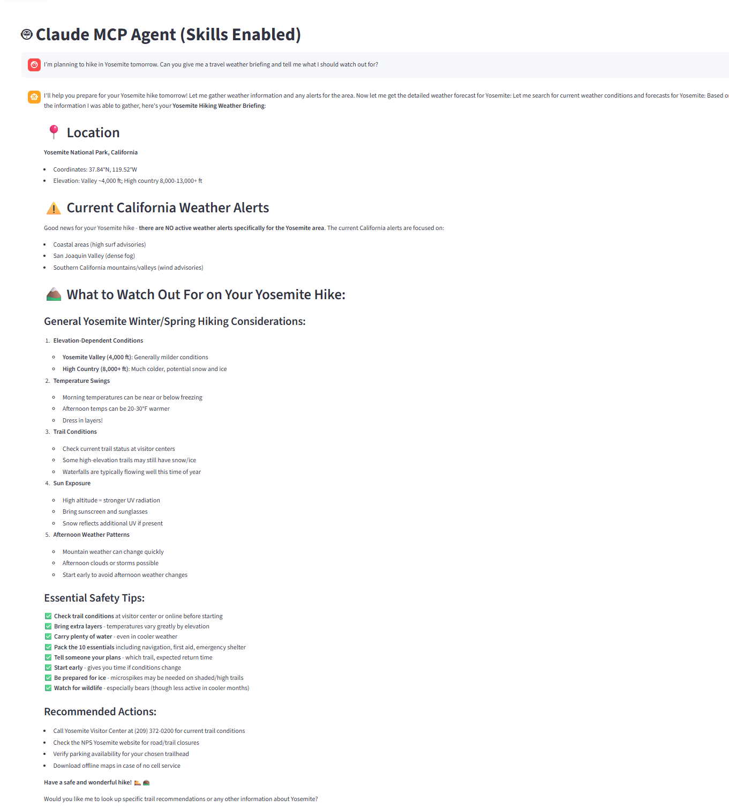

# 🌤️ MCP Weather Assistant
## Introduction
This project demonstrates how to build a **tool-augmented conversational AI** using **Model Context Protocol (MCP)**.  
It connects an **Anthropic Claude** model to a **custom weather MCP server** that retrieves real-time weather alerts and forecasts from the **U.S. National Weather Service (NWS API)**.

## 🚀 Features
- **FastMCP Server** (`weather.py`)
  - Exposes tools like:
    - `get_alerts(state)` → Fetches active weather alerts by U.S. state.
    - `get_forecast(latitude, longitude)` → Fetches detailed weather forecasts for a given location.
  - Uses the official [NWS API](https://www.weather.gov/documentation/services-web-api).

- **MCP Client** (`client.py`)
  - Launches the MCP server and connects via stdio.
  - Integrates with **Anthropic Claude** (`claude-sonnet-4-5-20250929`).
  - Lets Claude **automatically call weather tools** when responding to user queries.
  - Provides an **interactive chat loop** where users can type queries like:
    > “Show me the weather alerts in California”  
    > “What’s the forecast near 37.77, -122.42?”

- **.env Support**
  - Loads your Anthropic API key automatically via `dotenv`.


## 🧠 How It Works
### 🧠 System Flow
```text
User Query  →  MCP Client  →  Claude Model (via Anthropic API)
                    ↓
              MCP Server Tools
              ↙︎               ↘︎
    get_alerts(state)     get_forecast(lat, lon)
```
## Project Structure
```graphql
BASICMCP/
│
├── mcp_client/
│   ├── .venv/                     # Virtual environment for MCP client
│   ├── .env                       # Stores Anthropic API key
│   ├── client.py                  # MCP client that connects to the weather server
│   ├── list_models.py             # Lists available Anthropic models
│   ├── code_explanation.md        # Explanation of the MCP client code
│   ├── pyproject.toml             # Project dependencies for MCP client
│   ├── uv.lock                    # uv dependency lock file
│   └── README.md                  # Documentation for the MCP client
│
├── weather/
│   ├── .venv/                     # Virtual environment for weather server
│   ├── weather.py                 # FastMCP server defining get_alerts & get_forecast tools
│   ├── StateCodes.py              # Contains state code mappings for NWS API
│   ├── main.py                    # Entry point to run the weather MCP server
│   ├── code_explanation.md        # Explanation of the weather server logic
│   ├── pyproject.toml             # Project dependencies for weather server
│   ├── uv.lock                    # uv dependency lock file
│   └── README.md                  # Documentation for the weather module
│
└── README.md                      # Main project documentation


```
### Architecture Overview
1. `weather.py` (inside the weather folder)
- Runs a **FastMCP server** that defines two callable tools:
    - `get_alerts(state)` → Fetches current weather alerts for a US state.
    - `get_forecast(latitude, longitude)` → Returns a short-term forecast for the given coordinates.
2. `client.py` (inside the mcp_client folder)
- Launches an **MCP client** that connects to the weather server, initializes an MCP session, and allows interaction through Anthropic’s Claude API.
3. When you ask Claude a question, it can decide to **call a tool**.
4. The result is sent back to Claude for reasoning and response generation.

## 🛠️ Installation (Using uv)
### 1. Installing uv
#### 🪟 Windows (PowerShell)
```bash
powershell -ExecutionPolicy ByPass -c "irm https://astral.sh/uv/install.ps1 | iex"
```
#### 🐧macOS / Linux
```bash
curl -LsSf https://astral.sh/uv/install.sh | sh
```
### 1. Clone the Repository
```bash
git clone https://github.com/yourusername/mcp-weather-assistant.git
cd mcp-weather-assistant
```
### 2. Set Up the Virtual Environment
```powershell
# Create a new directory for your project
uv init weather
cd weather

# Create virtual environment and activate it
uv venv
.venv\Scripts\activate

# Install dependencies
uv add mcp[cli] httpx anthropic python-dotenv

# (Optional) Create a new server file
New-Item weather.py
```
### 3. Run the Project
```bash
python mcp_client/client.py weather/weather.py
```


## First Running Result by Using Agent Skills
